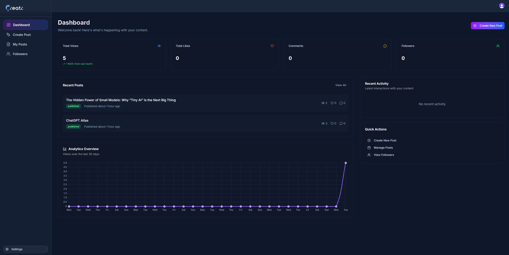
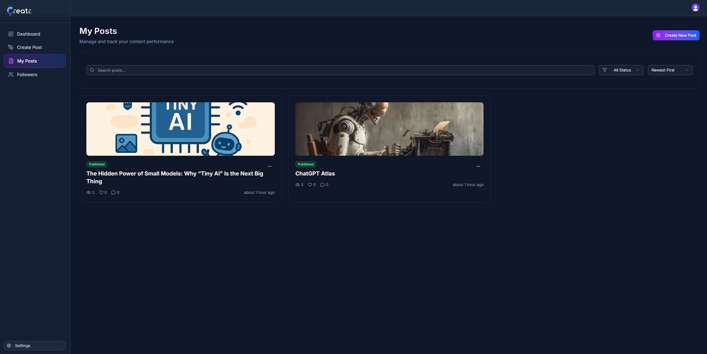
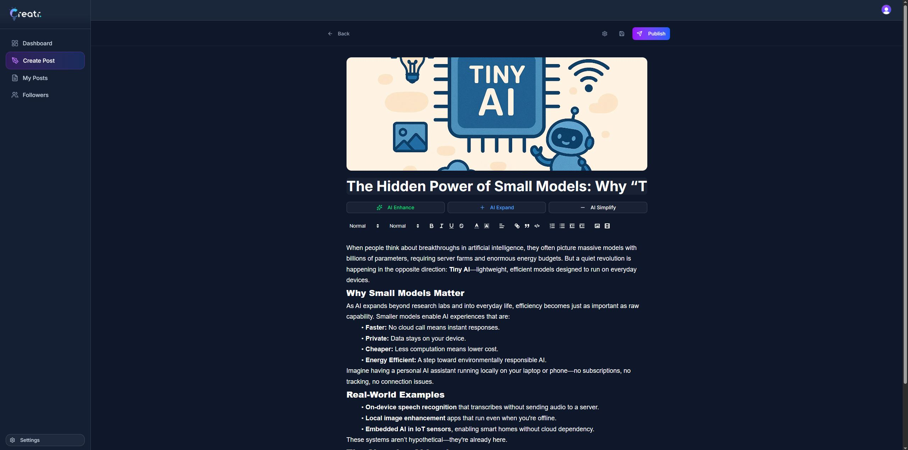

## Creator – AI-Powered Content Creation Platform (Built with Next.js)

Creator is a full-stack AI content creation and publishing platform designed to help anyone write, edit, design, and share posts effortlessly.
It blends artificial intelligence, manual editing tools, and powerful image transformations, giving users a complete and modern content-creation workflow.

This project is developed in Next.js, taking advantage of real-time databases, authentication providers, and modern UI libraries to deliver a fast, smooth, and professional user experience.

---

### 📸 Screenshots
#### Dashboard



#### My Posts


#### Create Post


---

### 🚀 Key Features

✨ AI-Generated Content (with manual editing)

Users can generate AI-based content, then refine it by:
* Expanding
* Simplifying
* Enhancing
* Editing manually in a rich text editor

This ensures the final content feels polished and personal.

---

### 🎨 Smart Image Editing

Powered by ImageKit, users can instantly enhance images:
* Remove background
* Add shadows
* Adjust aspect ratio
* Apply smart cropping (face / center focus)
* Add text overlays
* Resize or transform images

No design skills required.

---

###  `.env.example`
``` 
CONVEX_DEPLOYMENT=

NEXT_PUBLIC_CONVEX_URL=

NEXT_PUBLIC_CLERK_PUBLISHABLE_KEY=
CLERK_SECRET_KEY=

NEXT_PUBLIC_CLERK_SIGN_IN_URL=/sign-in
NEXT_PUBLIC_CLERK_SIGN_UP_URL=/sign-up

CLERK_JWT_ISSUER_DOMAIN=

NEXT_PUBLIC_IMAGEKIT_PUBLIC_KEY=
NEXT_PUBLIC_IMAGEKIT_URL_ENDPOINT=
IMAGEKIT_PRIVATE_KEY=

GEMINI_API_KEY=
```